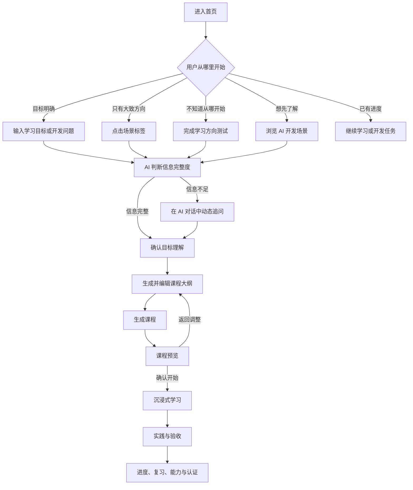
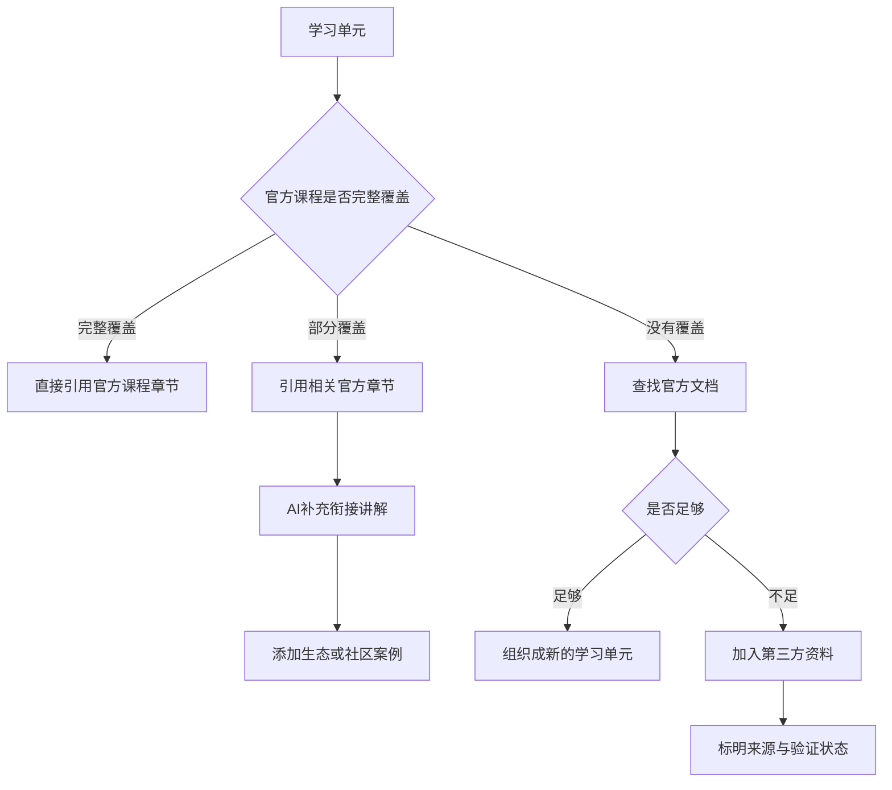

# 昇腾开发者智能学习平台产品结构 PRD

> 文档状态：产品结构基线 1.0  
> 适用范围：首页、AI 学习方案、课程预览、沉浸式学习、我的学习及内容治理  
> 核心资源策略：官方内容优先，AI 负责理解、编排、衔接和个性化表达

## 1. 产品定义

### 1.1 产品定位

面向昇腾开发者的智能学习平台。平台依托昇腾官方学习资源，通过 AI 意图识别、能力诊断和内容编排，为用户生成可信、可执行、可调整的学习方案，并在学习和开发过程中持续提供上下文辅助。

### 1.2 目标用户

用户熟练程度是动态画像属性，不作为固定入口：

- 新手：尚未建立昇腾与 AI 开发的基础认知。
- 入门：完成过基础学习，需要任务引导。
- 进阶：能够完成常规开发，需要系统提升或解决复杂问题。
- 高阶：关注性能、架构和跨场景实践。
- 专家：需要前沿资料、复杂问题定位和知识沉淀。

用户的本次任务是产品分流的主要依据：

- 学习型任务：希望系统理解一个主题、掌握一项能力或准备认证。
- 开发型任务：希望完成迁移、训练、部署、调优、算子开发或故障排查。

### 1.3 核心价值

1. 以官方资源作为可信事实基础。
2. 用 AI 理解用户目标、基础、环境、时间与深度要求。
3. 将课程、文档、代码、实践和认证组织成量身定制的学习计划。
4. 让开发任务拥有可运行、可检查的结果，而不止是内容阅读。

### 1.4 需要解决的问题

- 学习资源入口分散，用户需要先理解平台分类。
- 部分资源老旧，缺少版本、更新时间和适用环境说明。
- 课程与用户当前目标、基础和时间不匹配。
- 学习路径、课程、文档、实践和认证没有围绕能力目标形成闭环。
- 学习中遇到的代码、环境和错误问题缺少上下文支持。

## 2. 产品结构原则

### 2.1 多种起点进入，同一目标模型收敛

首页允许用户直接输入、点击场景标签、完成方向测试或浏览 AI 开发场景。不同入口最终形成同一种结构化目标：

> 要完成的目标 + 当前基础 + 使用环境 + 可投入时间 + 期望深度

### 2.2 以学习单元统一内容对象

平台组织内容的基本对象是“学习单元”。课程、文档、视频、白板、代码、实践和测验是学习单元中的内容与活动，不再作为互相割裂的产品体系。

统一关系为：

> 能力目标 → 学习计划 → 学习单元 → 学习资源 + 实践任务 + 验收方式 → 能力证明或认证

### 2.3 AI 入口统一，可信内容底座优先

用户面对一个全站 AI 学习助手。助手根据首页、方案、预览、章节和练习上下文提供不同能力，共享用户目标与进度。AI 生成组织、衔接和个性化讲解；专业事实优先引用经过治理的内容来源。

## 3. 核心用户流程



## 4. 产品功能结构

### 4.1 智能学习首页

- 继续学习
  - 当前学习计划
  - 当前开发任务
  - 最近章节和下一步行动
- AI 目标输入
  - 滚动示例问题
  - 自然语言输入
  - 上传代码、报错或环境信息
  - 高频场景标签：新手入门、模型训练、模型迁移、推理部署、算子开发、故障排查
  - 更多开发场景
- 不知道从哪里开始
  - 学习方向测试入口
  - 测试结果和推荐起点
- AI 开发场景
  - 模型开发与训练
  - 模型迁移
  - 推理与部署
  - 算子开发
  - 性能调优
  - 故障排查
- 辅助入口
  - 全部官方资源
  - 认证
  - 社区与帮助

首页主视觉只突出 AI 目标输入和 AI 开发场景。课程、文档、案例和认证作为场景内部的资源类型，不在首页形成同等级的大型分类入口。

#### 搜索框启发规则

- 滚动示例使用完整句子，展示学习、开发、排错和认证等提问方式。
- 用户开始输入后停止滚动，避免干扰。
- 快捷标签点击后先带入输入框，允许用户补充，不直接提交。
- “更多开发场景”承接低频场景，控制首屏信息数量。

#### 学习方向测试

测试用于完全不知道从哪里开始的用户，建议询问：

1. 当前想完成什么。
2. 对昇腾和 AI 开发的熟悉程度。
3. 正在使用或希望学习的技术。
4. 更倾向系统学习还是完成开发任务。
5. 可投入时间。

测试结果必须给出具体学习起点，可继续生成学习方案或查看对应官方内容，不能只返回等级标签。

### 4.2 AI 目标确认与方案生成

- 识别学习型任务或开发型任务，并允许用户修正。
- 复用学习方向测试和历史画像，避免重复提问。
- 判断生成方案所需信息是否完整。
- 对宽泛目标进行动态追问，例如“学习算子开发”需要继续确认：
  - 主要目标：了解流程、完成首个算子、迁移已有算子或优化性能。
  - 当前基础。
  - 技术路线：Ascend C、TBE、MindSpore 自定义算子或待推荐。
  - 期望深度和时间。
- 每回答一个问题，自然滚动到下一条 AI 回复。
- 信息完整后展示 AI 的目标理解，用户确认后生成课程大纲。

### 4.3 课程大纲编辑

- 在同一 AI 对话页面中作为新的 AI 回复出现。
- 使用可拖拽、可滚动的课程结构画布。
- 展示课程目标、单元、章节、依赖关系和学习深度。
- 支持：
  - 调整单元和章节顺序。
  - 增加或删除单元与章节。
  - 调整章节数量。
  - 设置基础理解、标准实践或深入掌握。
  - 替换内容来源。
  - 局部重新生成。
- 用户确认大纲后生成完整课程。

### 4.4 课程预览

课程预览是独立页面，负责学习前决策，不与沉浸式学习页面合并。

- 课程名称和一句话价值。
- 学完后能完成的任务或获得的能力。
- 适合人群和前置知识。
- 预计总时长、单元数、实践数和测验数。
- 课程目录摘要。
- 官方资源占比、来源、版本、更新时间和验证状态。
- 相关认证或能力要求。
- AI 为该用户生成此课程的原因。
- 主要操作：开始学习。
- 辅助操作：返回调整大纲、保存稍后学习、查看来源。

### 4.5 沉浸式学习工作台

- 内容学习区
  - 视频讲解
  - 白板讲解
  - 图文内容
  - 多种视图同步切换
- 代码与实践区
  - 代码示例
  - 视频时间点与代码段关联
  - 在线编辑和运行
  - 环境、依赖和输出说明
- 资料与来源区
  - 官方文档
  - API 与版本信息
  - 延伸阅读
  - 来源和验证状态
- 学习验证
  - 知识测验
  - 实践任务
  - 运行结果检查
  - 开发产物验收
- 学习操作
  - 笔记、收藏、标记不理解和加入复习
  - 上一节、下一节和继续上次进度

### 4.6 全站 AI 学习助手

- 理解当前页面、章节、代码和用户目标。
- 解释概念、代码与错误。
- 根据用户基础调整讲解深度。
- 修改局部学习计划。
- 总结章节并生成复习题。
- 推荐下一步行动。
- 将对话保存为笔记或待复习内容。

### 4.7 我的学习

- 当前学习计划与开发任务。
- 学习进度和下一步行动。
- 能力地图、测验和实践结果。
- 笔记、代码收藏、错题和复习计划。
- 完成课程、项目产物、认证进度和能力证明。
- 手动收藏和 AI 推荐的计划或资源。

AI 助手读取这些数据并提供服务，但不单独拥有另一份进度、笔记、推荐或认证数据。

## 5. 学习单元信息模型

学习单元是 AI 编排课程的最小可维护对象。每个学习单元至少包含以下组成：

| 组成 | 作用 | 必需性 | 示例 |
| --- | --- | --- | --- |
| 单元目标 | 描述完成后能够做什么 | 必需 | 完成 CANN 环境检查 |
| 核心依据 | 提供权威事实与步骤 | 必需 | CANN 官方安装文档 |
| 课程内容 | 复用已有结构化讲解 | 条件必需 | 官方课程第 2 章 |
| 操作示例 | 将知识转换为可执行动作 | 实践型单元必需 | 官方 `check_env.py` |
| 衔接讲解 | 处理官方资源间断点和个性化解释 | 按需 | AI 根据官方资料生成前置说明 |
| 常见问题或案例 | 补充真实开发情境 | 按需 | 经验证的社区环境问题案例 |
| 版本与环境 | 限定内容适用范围 | 必需 | CANN 8.x、Ubuntu 22.04 |
| 来源与验证状态 | 支撑可信度判断 | 必需 | 官方／人工验证／更新时间 |
| 验收方式 | 判断是否真正完成 | 必需 | 成功识别设备并输出版本 |

示例：

```text
学习单元：完成 CANN 环境检查
├── 核心依据：CANN 官方安装文档
├── 课程内容：官方课程第 2 章
├── 操作示例：官方 check_env.py
├── 常见问题：社区精选案例
├── AI 讲解：根据上述资料生成
└── 验收：用户成功识别设备并输出版本
```

## 6. 课程内容来源与治理

### 6.1 来源优先级

1. **昇腾官方内容**：课程、文档、代码、实验和认证要求，默认优先。
2. **生态官方内容**：MindSpore、ModelArts 等生态产品的官方内容，标明组织和适用版本。
3. **精选社区或第三方内容**：只用于官方内容不足、案例补充或现实问题说明，必须标明作者、来源、更新时间和验证状态。

AI 生成内容不作为事实来源。AI 负责摘要、重组、衔接、难度适配和个性化解释，并保留引用依据。

### 6.2 内容选择决策



### 6.3 内容状态

每一条进入学习方案的内容至少记录：

- 来源类型和原始链接。
- 内容所有者或发布组织。
- 适用产品和版本。
- 发布时间和最近更新时间。
- 人工验证状态及验证时间。
- 是否可被 AI 改写、摘要或仅可引用。
- 被替换或失效时的迁移规则。

### 6.4 展示规则

- 官方原文、AI 衔接和社区案例在视觉上明确区分。
- 用户可查看 AI 结论引用了哪些资料。
- 对存在版本冲突或未验证的内容给出具体提示。
- 第三方内容不能在无标识的情况下成为关键操作步骤的唯一依据。

## 7. 跨页面能力

| 能力 | 主要入口 | 核心数据与规则 | 设计约束 |
| --- | --- | --- | --- |
| AI 学习助手 | 首页、方案、预览、章节、代码、练习 | 当前目标、页面上下文、用户问题和进度 | 全站统一助手，页面只定义入口和上下文 |
| 搜索与推荐 | 首页、场景、资源列表 | 目标、场景、难度、环境、来源 | 相同筛选条件含义一致 |
| 学习进度 | 计划、预览、目录、章节、我的学习 | 位置、完成条件、验收结果 | 所有页面显示同一套进度 |
| 内容可信度 | 大纲、预览、课程、代码、资料 | 来源、版本、更新时间、验证状态 | 区分官方、生态、社区和 AI 内容 |
| 笔记与复习 | 视频时间点、白板节点、代码、我的学习 | 原始位置、批注、复习时机 | 笔记必须能回到原始内容 |
| 能力与成果 | 实践、课程结束、认证、我的学习 | 能力节点、验收结果、认证条件 | 成果对应真实学习或开发行为 |

## 8. 关键产品决策

### 8.1 保留独立课程预览

AI 方案页回答“AI 是否理解正确、课程如何组织”；课程预览回答“这门课是否适合我”；沉浸式学习回答“我现在如何完成学习”。三个阶段不能互相替代。

### 8.2 首页不只保留一个输入框

首页同时提供滚动示例、场景标签、学习方向测试和 AI 开发场景，帮助不同明确程度的用户。所有入口最终收敛到统一目标模型，而不是收敛为单一 UI 入口。

### 8.3 首页推荐内容按开发场景组织

首页不同时突出课程、路径、认证、文档、活动等多套分类。它们作为 AI 开发场景内部的资源类型出现，全部资源浏览和社区帮助降为辅助入口。

### 8.4 AI 分身与个人空间分工

“我的学习”拥有进度、笔记、能力、推荐和认证数据。AI 学习助手调用这些数据完成解释、提醒和推荐，避免维护两套相同信息。

### 8.5 激励降权

排行榜和学习时长不进入首期核心路径。优先展示课程完成、实践产物、能力节点和认证进度，确保激励对应真实学习结果。

## 9. 分阶段实施

### 阶段 1：内容底座和目标模型

- 定义能力节点、学习单元、资源、实践和验收数据模型。
- 盘点官方资源，补齐来源、版本、更新时间和验证状态。
- 定义学习型和开发型任务的识别规则。
- 统一进度和完成条件。

### 阶段 2：核心生成路径

- 上线首页滚动示例、场景标签和学习方向测试入口。
- 实现 AI 意图识别、动态追问、目标确认和大纲编辑。
- 生成基于官方资源的学习计划。
- 上线独立课程预览和基础“我的学习”。

### 阶段 3：沉浸式学习与任务验收

- 打通视频、白板、图文、代码和官方文档。
- 建立视频时间点与代码段关联。
- 增加在线运行、错误解释、实践任务和结果验收。
- 建立开发场景模板。

### 阶段 4：持续学习闭环

- 上线笔记、错题、复习计划和能力地图。
- 根据学习结果动态调整计划。
- 将认证要求映射到能力节点。
- 展示项目产物和能力证明。

### 阶段 5：可信内容扩展

- 引入生态官方内容。
- 在治理规则下引入精选社区和第三方内容。
- 建立内容失效、版本冲突、替换和人工复核机制。

## 10. 首期成功判断

- 用户能从首页完成目标表达或获得明确学习起点。
- 宽泛目标经过追问后能够形成可确认的结构化目标。
- 用户能够理解并调整 AI 生成的大纲。
- 课程预览能够支持开始、返回调整或稍后学习的决策。
- 每个学习单元都有明确来源、适用版本和验收方式。
- 学习进度在计划、章节和“我的学习”中保持一致。
- 开发型任务可以通过运行结果或产物判断是否完成。
